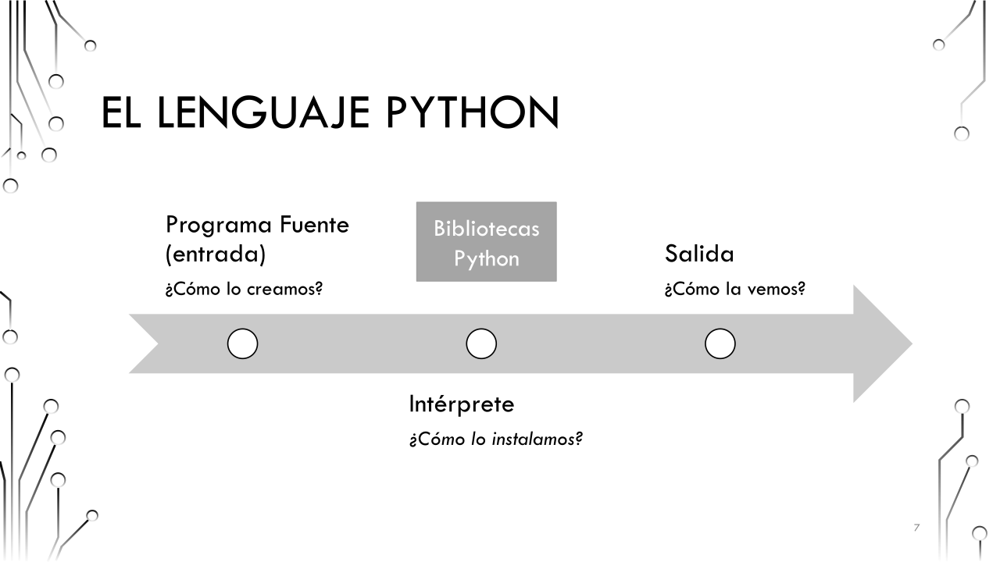
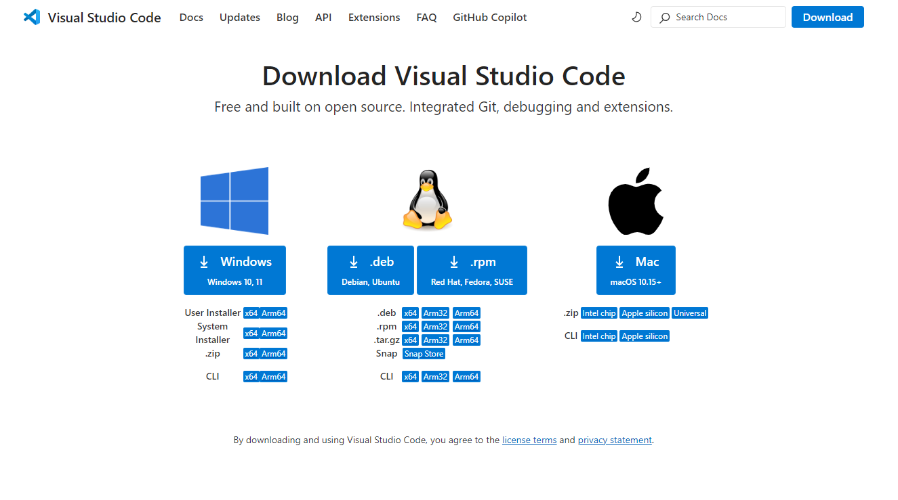
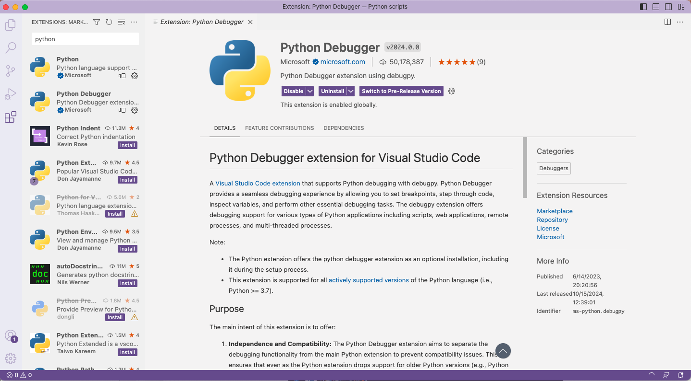
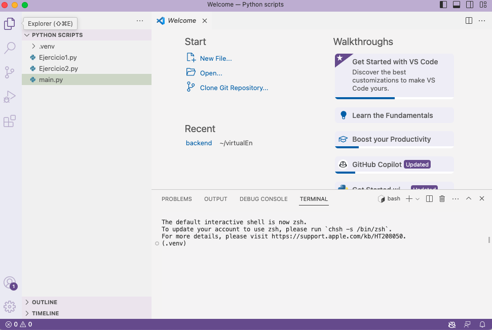
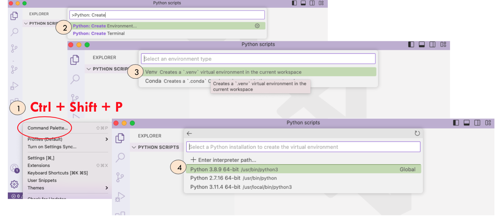

# Primer vistazo a Python

Vamos a ver cómo debemos instalar Python para comenzar a usarlo. 

## ¿Cómo funciona Python?



Para el intérprete hay opciones:
* Instalar lo imprescindible, el intérprete (Python.org)
* Instalar el intérprete + "extras" (Anaconda, Mamba,...)

Para la entrada de datos:
* Ficheros .py creados
* Ficheros interactivos (.ipynb)

Para la salida de datos:
* Visualización a través de terminal
* Visualización en hostings
* FIcheros interactivos (.ipynb)

### Entonces... ¿necesito tantos componentes?
Sí... y no. Para ayudarnos, existen los `Entornos de Desarrollo Integrados (IDEs)`. 
Un IDE es una aplicación de software que combina herramientas como un editor de código (entrada), un depurador/compilador/intérprete y una terminal (salida) para facilitar la creación de programas informáticos. 

Existen varios IDEs de Python (Spyder, PyCharm, Atom,...). Nosotros en clase vamos a trabajar con `Visual Studio Code`.

```{tip}
Existen herramientas en la nube que nos permiten trabajar con Python sin tener que instalar nada en nuestro ordenador. Nosotros veremos más adelante la herramienta Google Colab. [google
colab](https://research.google.com/colaboratory/).
```
## Instalando VSCode

Lo primero, vamos a descargar la herramienta:

Descargar la herramienta y elige la versión según tu SO: https://code.visualstudio.com/Download



El primer paso ahora es instalar la extensión de Python desde VS. Para ello, tenemos que ir al apartado de Marketplace en el menú lateral izquierdo, buscar "Python" y seleccionar e instalar el paquete correspondiente



¡Ya tenemos la herramienta instalada y preparada para trabajar en Python!

## Organización de VS Code

Este es el aspecto de VSCode:


* Ficheros fuente: Son los ficheros que estamos editando

* Consola/Terminal: Desde aquí podemos ejecutar scripts y/o ver la salida de nuestro código

* Marketplace extensiones: Para instalar nuevos paquetes o módulos

* Run & Debugging: Herramienta para depurar código o para ejecutarlo directamente

* Git: Nos permite una conexión remota con un repositorio para sincronizar nuestros ficheros en la nube. 

* Info sobre el script activo: Nos da información sobre la codificación, las líneas, cómo se está indentando el código, qué intérprete está activo y si tenemos un entorno virtual, entre otros.

* Ejecución/Depuración: Atajo para ejecutar y/o depurar fácilmente.

* Explorer: Nos muestra el **workspace** abierto.

## Antes de empezar: Creando nuestro workspace

VS Code trabaja con **workspaces** o entorno de trabajo, que no es más que una carpeta que contiene todo el código fuente (no confundir con el workspace de MATLAB). 

Al principio, no tendremos ninguna carpeta abierta. podemos crear una nueva o abrir una existente desde el menú lateral izquierdo, en la opción "Open Folder", o bien en el menú superior.


Todo lo que se encuentre en esa carpeta o directorio, pertenecerá al mismo workspace por defecto. Podemos encontrar la estructura del workspace en el menú lateral izquierdo. 




## Antes de empezar: Configurando un Entorno Virtual

Un entorno virtual (Virtual Environment) nos permite instalar paquetes y hacer modificaciones en el intérprete sin que afecte al intérprete global del sistema. Es una buena práctica en programación.

Para crear un entorno virtual, podemos utilizar la herramienta que nos ofrece el propio VSCode, o bien desde la terminal. Os mostramos las dos opciones

### Desde VSCode

La imagen siguiente ilustra el proceso:


1. El primer paso es acceder a la Paleta de Comandos, que la podéis encontrar en el menú lateral inferior o bien `Ctrl+Shift+P`. Se abrirá un buscador.
1. En el buscador se escribe `Create Environment` y se selecciona la opción
1. Os pueden aparecer dos opciones, venv y conda. `venv` es nativo de Python y no requiere instalación adicional, pero no gestiona versiones de Python, y es más difícil manejar dependencias externas o librerías grandes. Por su parte, `conda` hay que instalarlo y es más pesado, pero es un gestor de entornos más potente y mejora la gestión de dependencias externas y paquetes. Nosotros vamos a elegir `conda`.
1. Finalmente, se debe elegir la versión de Python que se utilizará para compilar y ejecutar los programas. Normalmente, se elige la que viene por defecto o la más reciente. 

Una vez configurado el Entorno Virtual, se creará una carpeta llamada `.venv` o `.conda` en el propio workspace. Cada vez que abramos el workspace en VS Code, el entorno virtual se activará automáticamente. 


### Desde la terminal 
Podemos crear el Entorno Virtual con `venv` con este comando: 
```
python -m venv .venv
```

Para activar el entorno: 
```
source venv/bin/activate  # Mac/Linux
.\venv\Scripts\activate   # Windows
deactivate # Para desactivarlo
```

Si queremos usar `conda`, hay que comprobar si está instalado:
```
conda --version
```
Si no está instalado, podemos instalarlo desde https://docs.conda.io/en/latest/miniconda.html con las opciones por defecto. 

Para crear el entorno:
```
conda create -n mi_entorno python=3.10
````
Para activarlo/desactivarlo:
```
conda activate mi_entorno
conda deactivate 

```
