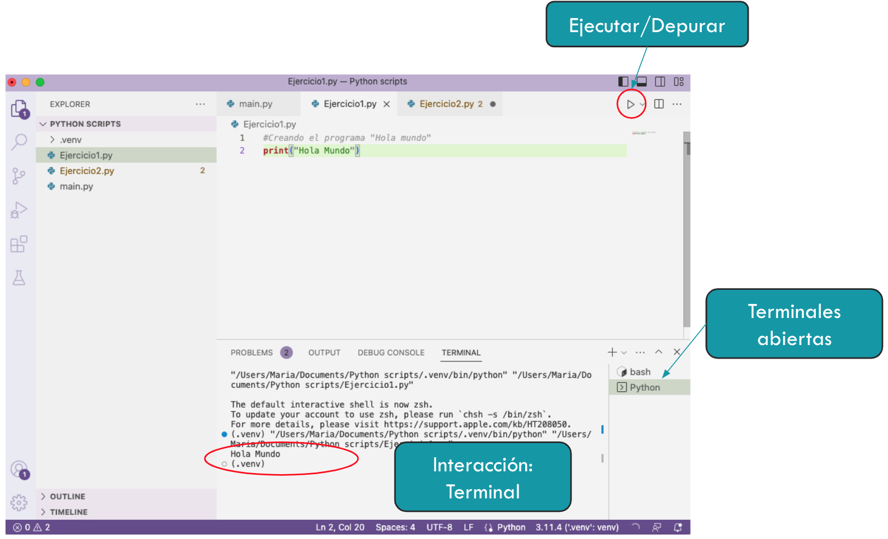
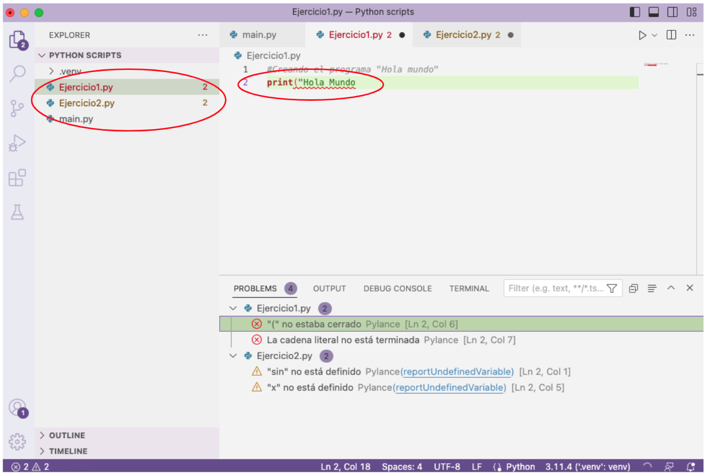
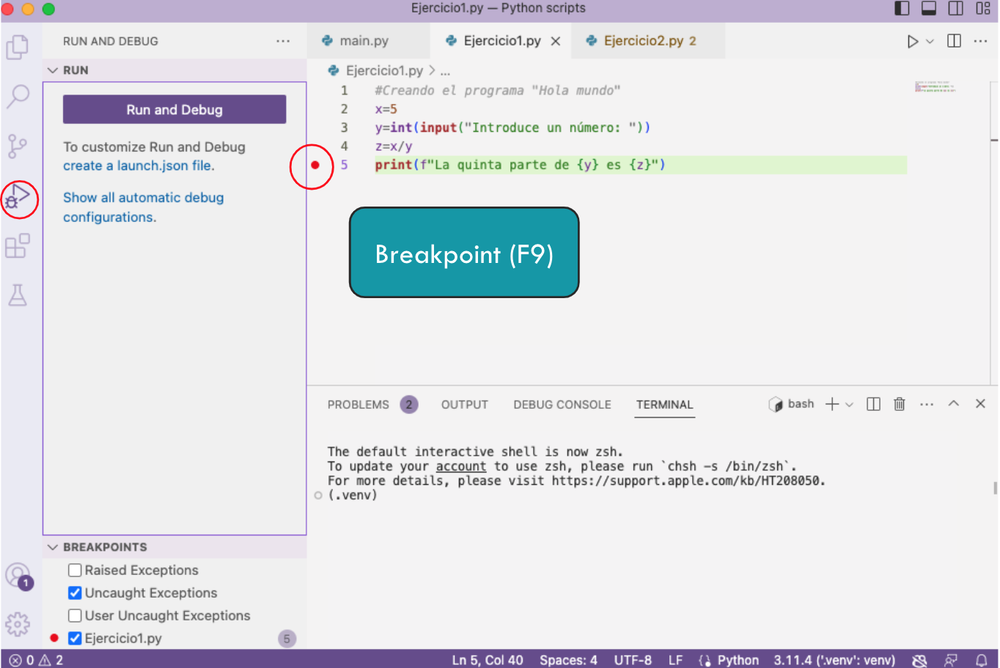
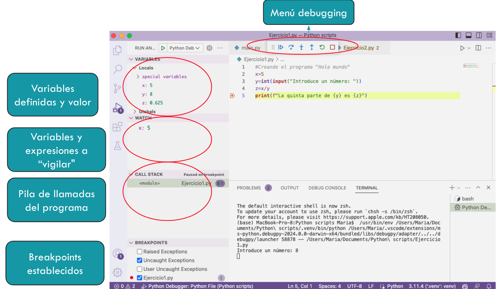

# Primeros pasos con VS Code

Una vez que hemos instalado Python y sus componentes, ya podemos empezar a programar. Comenzaremos con un ejercicio muy sencillo, el famoso `Hola Mundo`.Para ello, creamos un nuevo fichero en nuestro workspace y escribimos `print("Hola mundo")`. 

 

Al ejecutar, podemos ver la salida en la terminal del VSCode. Es ahí donde también introduciremos la entrada de los datos en caso necesario.

Dejamos aquí un ejemplo lo que podemos ver al ejecutar un fichero fuente.

 

* En "Problems" (normalmente en la parte inferior) podemos encontrar varias notificaciones: 
    *  Amarillo: warnings, avisos que alertan sobre posibles errores de ejecución  o aspectos del código fuente
    *  Rojo: errores. Suelen ser errores de sintaxis o de enlazado de módulos. 
* En Terminal podemos ver la ejecución del programa y la salida del mismo, si la hay. 

## Breve introducción al debugger de VS Code

Un depurador es una herramienta que nos permite un poco más de control en la ejecución de un programa. Entre otras cosas, podemos parar la ejecución, analizar los valores de las variables en determinado momento, las llamadas a funciones, etc. 

Nosotros vamos a utilizar el depurador que viene instalado en el VS Code. Para ejecutarlo, podemos utilizar la barra lateral izquierda y dejar la configuración por defecto. 

Si queremos parar la ejecución en un determinado momento, podemos utilizar los **breakpoints** o puntos de interrupción. Para colocarlos, basta con hacer click (o F9) a la izquierda de la línea en el fichero fuente

Una vez comenzamos a depurar (o *debuguear*), nos aparecen varias opciones cuando la ejecución llega al punto de interrupción: 

* Menú debugging: Nos permite continuar con la ejecución hasta el siguiente breakpoint (si lo hay), ejecutar solo la siguiente instrucción, entrar dentro de la función en su caso, etc.
* Variables definidas: Podemos ver las variables definidas y qué valor contienen en ese momento.
* Variables y expresiones a “vigilar": Podemos añadir aquí las variables o expresiones que deseamos evaluar o realizar un seguimiento. Esto es útil cuando existen muchas variables definidas en un programa.
* Pila de llamadas del programa: Aquí se muestran los scripts que están involucrados en la ejecución y sus dependencias.
* Breakpoints establecidos: Se mostrarán los puntos de interrupción definidos para la ejecución del programa.

## Conclusiones

Hemos aprendido cómo funciona Python, cómo instalarlo y a ejecutar y depurar un primer programa. Ahora podemos comenzar con unas nociones básicas de programación en este lenguaje. 

